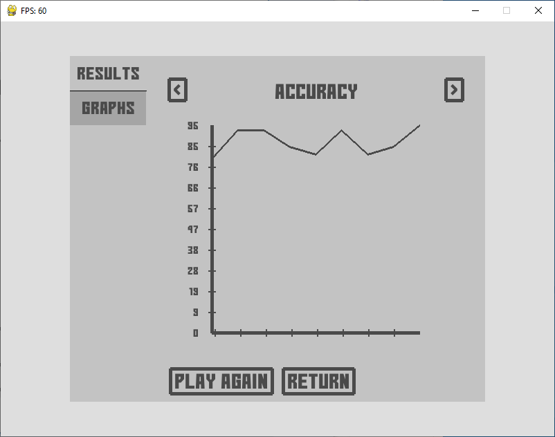
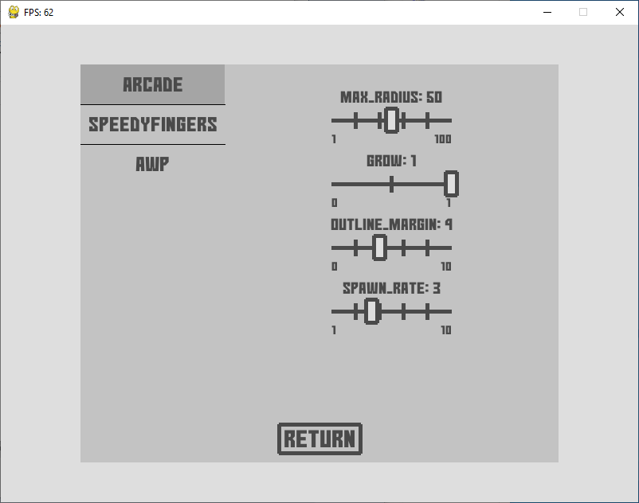

# pyaimbooster
Here comes a tool for improving your aim written in Python with help of Pygame library. It's in an early stage of development.

# Features
- Several game modes
- Adjustable diffuculty level
- Your progress drawn on graphs

# Screenshots

# Todo
- Add new training modes
- Allow fullscreen
- Custom crosshair?