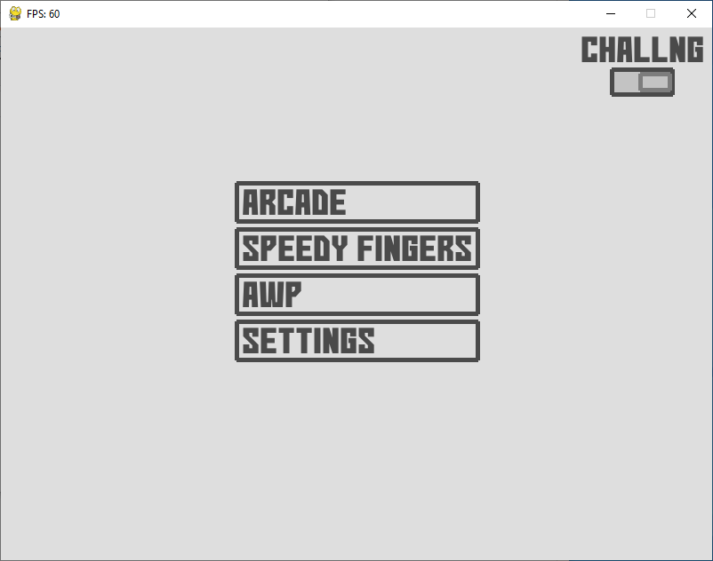

# pyaimbooster
Here comes a tool for improving your aim written in Python with help of Pygame library. It's in an early stage of development.

# Screenshots

# Todo
- Add new training modes
- Save stats to check for aim improvements
- Allow to customize a training by GUI